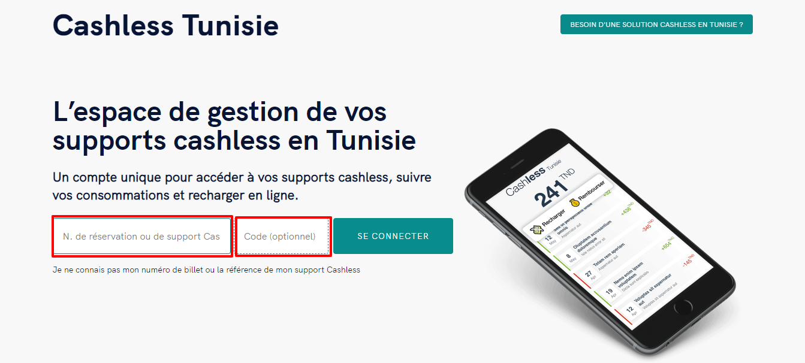

# Comment activer ou désactiver mon Bracelet Bip Pay cashless ?

Vous pouvez désactiver et activer votre bracelet **Bip Pay** grâce au mail reçu lors de la réception de celui-ci .

Vous pouvez aussi vous rendre sur [**Cashless.tn**](https://cashless.tn/) et vous connecter avec numéro de votre support cashless et votre code confidentiel fournis dans le mail .

**Rechercher le mail reçu contenant vos accès a votre comte** **(Cashless@bip.events)**

 (1).png>)

.png>)

.png>)

**Vous avez perdu votre bracelet Bip Pay Veuillez le signalé au point Bip Charge le plus proche merci .**

Vous avez retrouvé votre Bracelet et que vous souhaitez le réactiver vous avez qu'à cliquer sur le bouton Activer.

