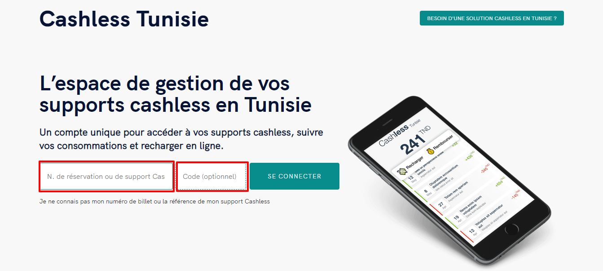

# Comment consulter mon solde et mes opérations?

Vous pouvez suivre vos transactions , consulter votre solde , recharger votre compte en ligne , désactiver et activer votre bracelet **Bip Pay** grâce au mail reçu lors de la réception de celui-ci  .

vous pouvez aussi vous rendre sur [**Cashless.tn**](https://cashless.tn/) et vous connecter avec numéro de votre support cashless et votre code confidentiel fournis dans le mail .

.png>)

.png>)

