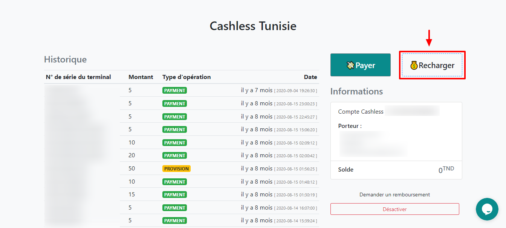
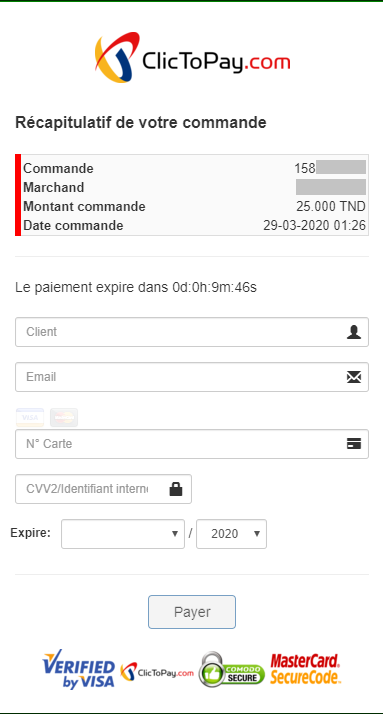

# Comment Recharger mon compte Cashless?

## Deux Méthodes Pour Recharger Mon Compte

### Méthode 1

#### Recharge En Ligne Par Carte Bancaire :

« Certains organisateurs désactivent la recharge en ligne vous pourrez recharger votre compte dans l’un des points de recharge en espèce sur place »

Pour pouvoir recharger votre compte en ligne vous devez tout d'abord avoir un compte sur [https://cashless.tn](https://cashless.tn/) voir notre page [**Réserver un compte cashless**](creer-un-compte-cashless.md) **** .

## Etape 1&#x20;

Cliquer sur 💰 Recharger&#x20;

## Etape 2 &#x20;

Choisissez le montant à recharger sur votre compte et cliquer su aller au paiement&#x20;

 (1).png>)

## &#x20;Etape 4

Effectuez le paiement avec votre carte bancaire

### Méthode 2

### Recharge En Espèce :

Pour recharger en espèce veuillez vous renseigner sur l’emplacement des points de **Bip charge** sur place .
