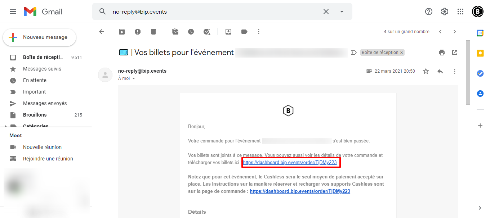
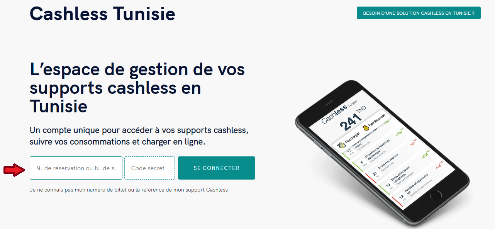

# Réserver un compte cashless

\
Pour cela, vous avez Trois méthodes :

**Méthode** **1**

Après avoir finaliser votre commande depuis la page de l’événement vous n'avez qu'à cliquer sur le bouton Aller au compte cashless de XXXXX&#x20;

**Méthode 2**

**Si Vous avez déjà finalisez votre commande :**

Rechercher le mail reçu contenant votre Bip-ticket **(no-reply@bip.events)** et cliquer sur le lien de la page de commande

.png>)

**Méthode 3**

Rendez-vous sur le site [https://cashless.tn](https://cashless.tn/)  puis saisissez votre référence du billet dans l'encart dédié.

**ATTENTION :** Le jour J vous allez vous présentez à la porte muni de votre billet et vous aller montrer le QR-CODE afin de le relier à votre compte cashless , Ainsi vous recevrez [**un mail contenant le numéro de votre Bracelet Bip Pay**](comment-consulter-mon-solde-et-mes-operations.md) et un code confidentiel. Ces informations vous permettront de vous connecter lors de vos futures visites sur l’espace cashless de l’événement.
