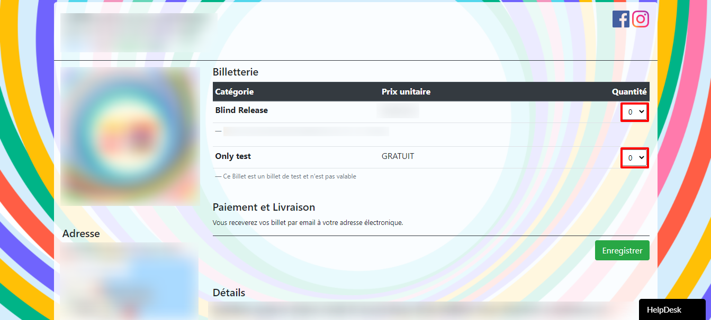

# Comment procéder à l'achat des billets ?

Pour acheter un ou des billets vous devez tout d'abord aller sur le lien de l'événement que l'organisateur partage sur sa page Facebook/Instagram/Message Privé....

« Seul les organisateurs déterminent les moyens de paiement accepté , renseignez vous auprès d'eux il est inutile d'essayer de contacter bip events »

## **Trois méthodes** possibles  :

**Méthode 1**&#x20;

**Réserver le billet via la méthode Hors Line ( Espèce , Virement , Chèque ) :**

1. Sélectionnez le nombre et le type du billet et cliquer sur Enregistrer

.png>)

2\. Remplissez le formulaire avec les information de l'acheteur et des participant et cliquer sur Aller au paiement

.png>)

.png>)

3 . Sélectionner le mode de Paiement Hors Ligne

.png>)

4 . Vérifier que vous avez reçu vos billets par mail sinon télécharger les via le bouton Télécharger vos billets &#x20;

.png>)

Si vous avez fermé votre page de commande et que vous n'avez toujours pas reçu vos billets Veuillez **** [**cliquer ici**](je-nai-pas-recu-mon-e-ticket-ou-mon-e-mail-de-confirmation-que-puis-je-faire.md) **** pour savoir quoi faire

**Méthode 2**

**Payer le billet avec votre carte bancaire :**

**Type De Carte :**

* Numéro : 54xxxxxxxxxxxx
* Validité : xxxx
* CVV : xxx

1. Sélectionnez le nombre et le type du billet et cliquer sur Enregistrer

2\. Remplissez le formulaire avec les information de l'acheteur et des participant et cliquer sur Aller au paiement

.png>)

.png>)

3\. Sélectionner Paiement par Carte Bancaire puis vous allez être rediriger vers la page de paiement en ligne

.png>)

4 . Vérifier que vous avez reçu vos billets par mail sinon télécharger les via le bouton Télécharger vos billets&#x20;

.png>)

Si vous avez fermé votre page de commande et que vous n'avez toujours pas reçu vos billets Veuillez **** [**cliquer ici**](je-nai-pas-recu-mon-e-ticket-ou-mon-e-mail-de-confirmation-que-puis-je-faire.md) **** pour savoir quoi faire

**Méthode 3**

Certain organisateurs cachent leurs billets gratuit ou payant par un code d'accès &#x20;

**Réserver le billet avec un Code d’accès :**

1. Entrer le code puis cliquer sur valider

2\. Sélectionner le billet fraichement apparus

3\. Entrez vos information et cliquer sur Aller au paiement

4 . Vérifier que vous avez reçu vos billets par mail sinon télécharger les via le bouton Télécharger vos billets&#x20;

Si vous avez fermé votre page de commande et que vous n'avez toujours pas reçu vos billets Veuillez **** [**cliquer ici**](je-nai-pas-recu-mon-e-ticket-ou-mon-e-mail-de-confirmation-que-puis-je-faire.md) **** pour savoir quoi faire

Si vous avez payé vos billets en plein milieu de la nuit ou que vous habitez à l’autre bout du monde, il est possible que cette opération prenne plusieurs heures et que vous ne receviez pas vos billets juste après votre achat.&#x20;

Dans certains cas, nous avons besoin de valider les paiements manuellement pour que vous puissiez recevoir vos billets.&#x20;

Mais soyez rassurés : nous sommes organisés pour que vous receviez toujours vos billets à temps.&#x20;
