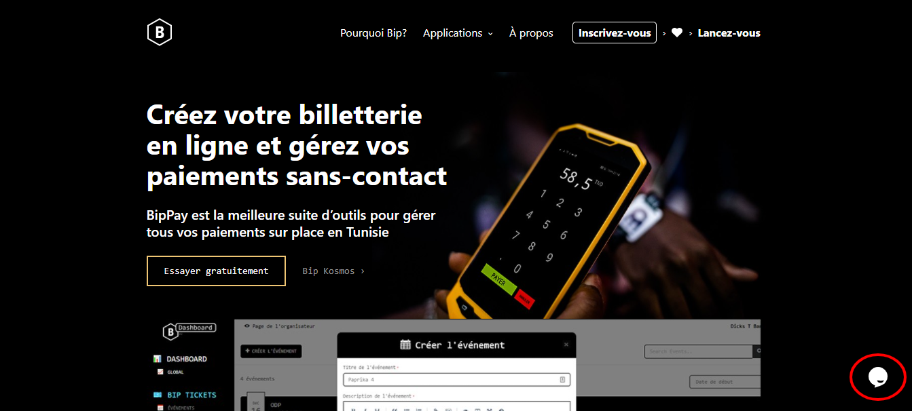

# Je n'ai pas reçu mon Bip-Ticket ou mon E-mail de confirmation que puis-je faire ?

Vous n'avez pas reçu votre e-mail de confirmation ? Vous ne retrouvez pas la page de votre commande ? Cette page est là pour vous aider.

### L’adresse e-mail que vous avez entrée est-elle la bonne ?

Si oui pas de panique : vous allez recevoir vos billets.&#x20;

**Rechercher le mail reçu contenant votre Bip-Ticket** **(no-reply@bip.events)**

.png>)

**Si vous utilisez Gmail, pensez à bien vérifier que ces e-mails ne sont pas dans l’onglet « Promotions » .**

**Si vous utiliser Yahoo ou autres, pensez quand même à bien vérifier dans vos « Spam ».**

**Si vous avez bien vérifié et que vous n'avez encore rien reçu , vous pouvez nous envoyer un message via notre Bipbot sur notre site web** [**Bip.events**](https://bip.events/)  **.**

Si vous avez payé vos billets en plein milieu de la nuit ou que vous habitez à l’autre bout du monde, il est possible que cette opération prenne plusieurs heures et que vous ne receviez pas vos billets juste après votre achat.&#x20;

Dans certains cas, nous avons besoin de valider les paiements manuellement pour que vous puissiez recevoir vos billets.&#x20;

Mais soyez rassurés : nous sommes organisés pour que vous receviez toujours vos billets à temps.&#x20;
